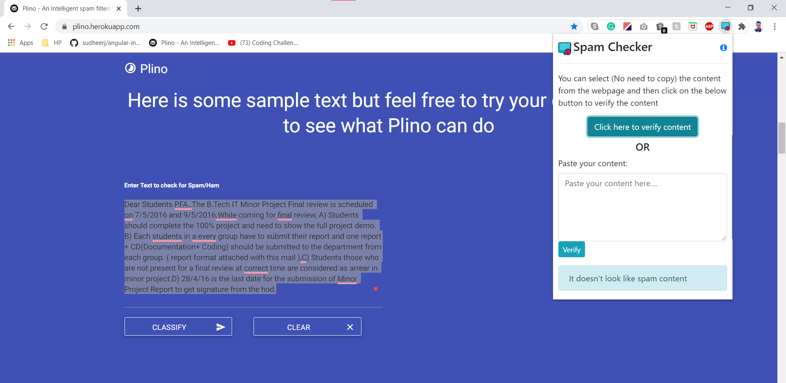

# Spam Checker
* Date Created: 5 september 2020
* Last Modification Date: 7 September 2020


## Created By 

* Roshan Kirtikumar patel (rs735202@dal.ca)

## Getting Started

**Spam Checker** is chrome browser extension that allow the user to check, whether the content of the website contain spam text or not.The user needs to just select the text and the extension will automatically fetch the text and provide the feedback about the text.The extension also allow the user to paste the content to the TextArea which will help the user to lidentify spam text in word or any other documents.



#### Language used :
The majority of code is written in Javascript and for stylying the content i ahve used html and bootstrap.

#### Access information :


---


## Prerequisites
To locally run the project you should have chrome browser installed in your computer.


---
## Installing

There are two options to get the project.
1. You can download the .zip file and then unzip the file to the required folder.
  1.1 Once you have unzipped the folder, open the folder in cmd and follow the next section Deployment.
**OR**
2. you can clone the project. To clone the project follow the below steps:
 2.1 create a new folder 
2.2 open cmd, and using cd command go to the folder location.
2.3 Run the below program.
    ```
    $  git clone https://github.com/Roshan0923/spam_filter_chrome_extension.git
    ```
3. Once you have the folder there is no need to compie and run the project.follow the below steps to directy add the extension in your browser.
4. Opne chrome browser.
5. Click on 3 dots situated on the righmost part on the tabs.
6. Go to More tools and select Extension.
7. Click on load unpacked button situated on the left side of the tab.
8. Select the folder from your local computer and upload the folder.
9. Congratulation!! You can now see the extension is added to the lit of extensions.


## Deployment
Currently the project is not deplyed on the chrome extension store.

---

## Built With
JavaScript, Html, Css

---


## Acknowledgments

* I have used [Plino - An Intelligent spam filtering System](https://plino.herokuapp.com/) API to verify wheather the text is spam content or not
* [Flaticon](https://www.flaticon.com/) : Used icons as `Default icon` of the extension.
